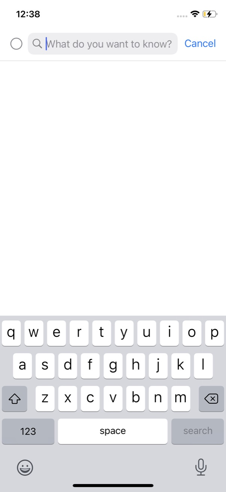
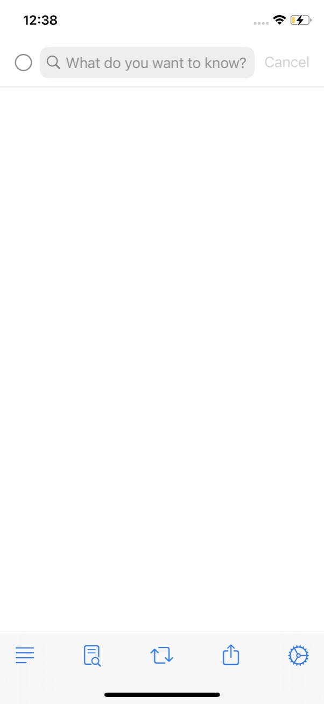
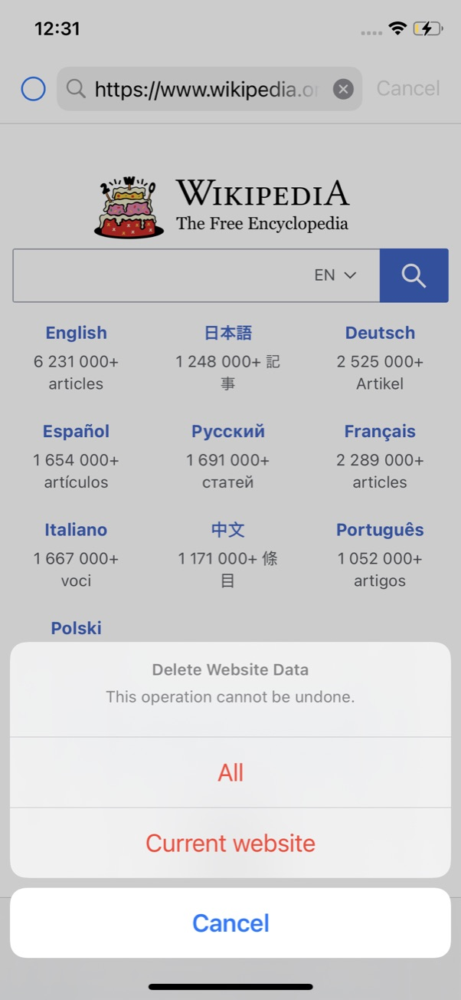
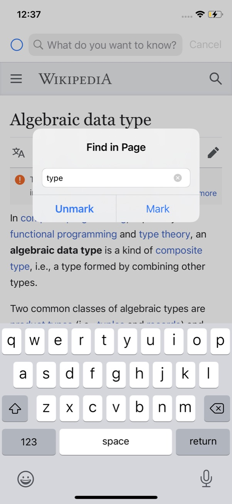
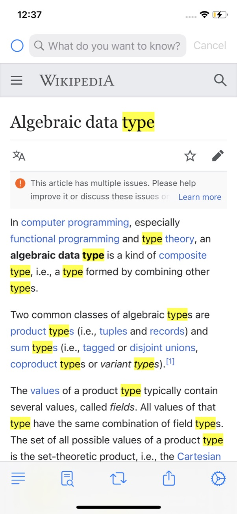
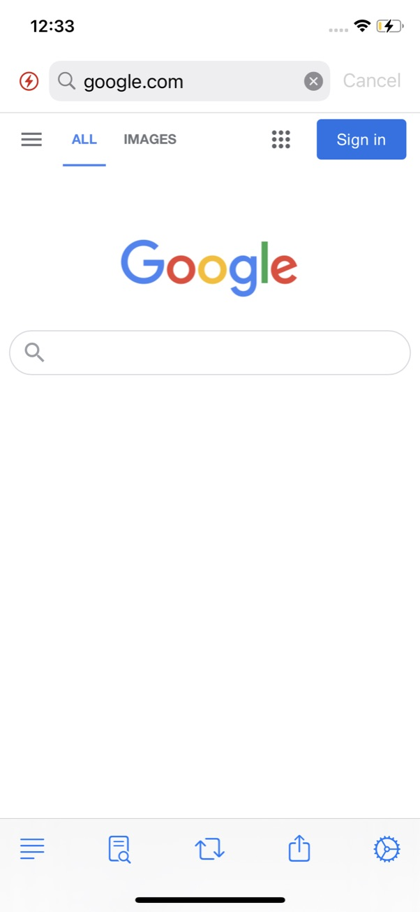
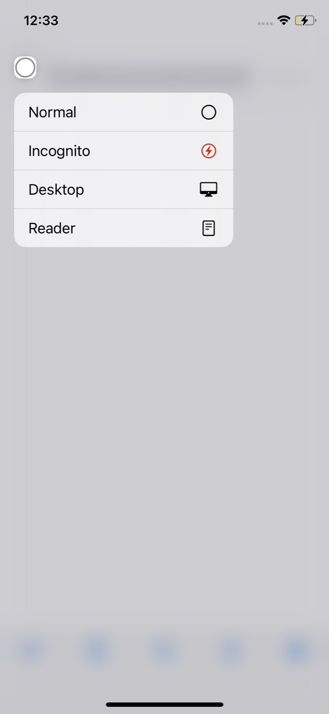
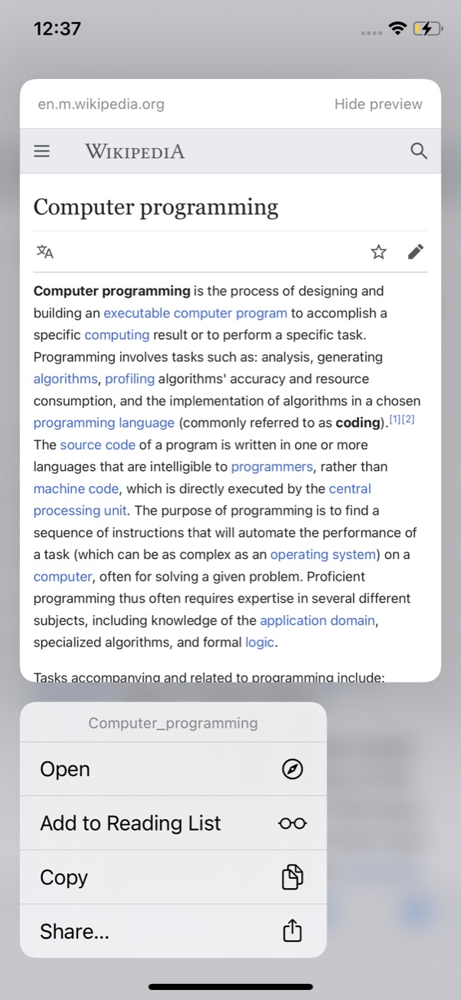
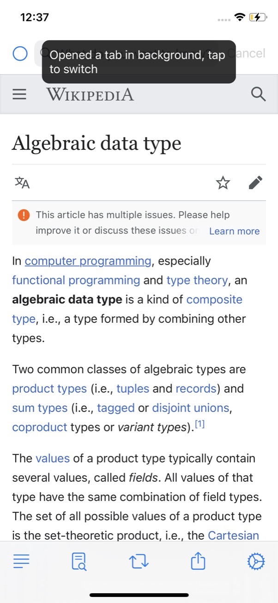
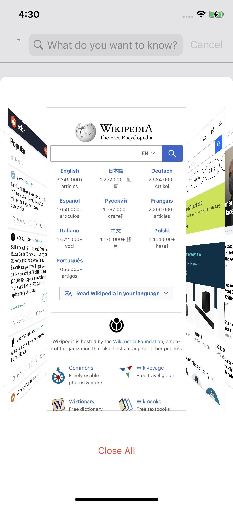

fosi (fō-sī)
===

A no frills iOS browser inspired by [firefox-focus](https://github.com/mozilla-mobile/focus-ios).

## Features
- Mutli tab support with coverflow tab viewer
- Incognito/Private mode support
- On device full text search over browsing history
- Universal dark mode, that converts web pages as well as PDFs to dark mode
- Built in content blocking
- Excellent completions support
- Easy gestures for common actions

## Screenshots

### Empty tab
  * tap redo button to bring up keyboard
  * double tap on toolbar to open new tab

<table>
  <tr>
    <td>    
      
    </td>
    <td>
        
    </td>
  </tr>
</table>

### Easily delete data

### Find in page
<table>
  <tr>
    <td>   
      
    </td>
    <td>
      
    </td>
  </tr>
</table>

### Incognito mode
  * long press on progress indicator to show modes
<table>
  <tr>
    <td>  
        
    </td>
    <td>
        
    </td>
  </tr>
</table>

### Peek and pop to open link in background tab
 * tap on the toast to switch to newly opened tab
<table>
  <tr>
    <td>  
      
    </td>
    <td>
      
    </td>
  </tr>
</table>

### Flick search box to see url, page title, and search keywords you started with
<table>
  <tr>
    <td>  
      
    </td>
    <td>
      
    </td>
    <td>
      
    </td>
  </tr>
</table> 

### Tab viewer
* long press on toolbar to show tab viewer
* swipe up on a tab to dismiss
* tap to open
<table>
  <tr>
    <td>  
      
    </td>
    <td>
      
    </td>
  </tr>
</table>
