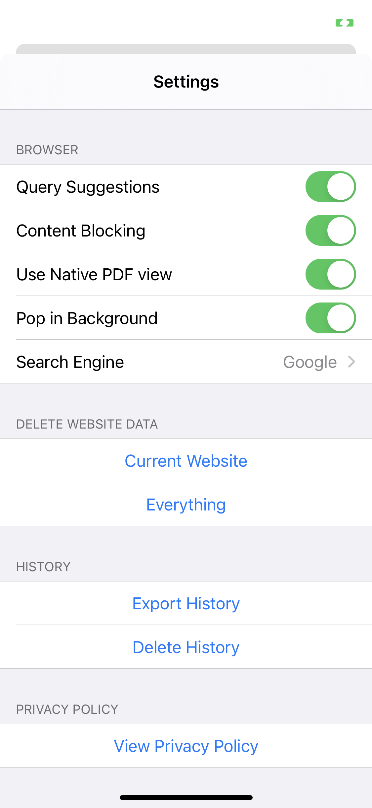
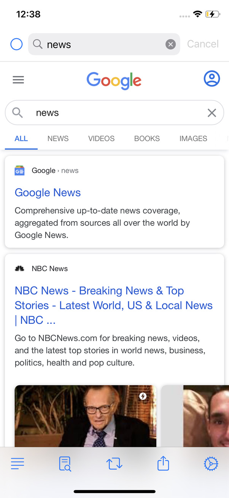

fosi (fō-sī)
===

A no frills iOS browser inspired by [firefox-focus](https://github.com/mozilla-mobile/focus-ios).

## Features
- Mutli tab support with coverflow tab viewer
- Incognito/Private mode support
- On device full text search over browsing history
- Universal dark mode, that converts web pages as well as PDFs to dark mode
- Built in content blocking
- Excellent completions support
- Easy gestures for common actions
- Use Native PDF view for easy pan + zoom gestures

## Screenshots

### Empty tab
  * tap redo button to bring up keyboard
  * double tap on toolbar to open new tab

   
   

### Tab viewer
* long press on toolbar to show tab viewer
* swipe up on a tab to dismiss
* tap to open

  
  

### Easily delete data, or control settings

 
 

### Find in page

 
 

### Incognito mode
  * long press on progress indicator to show modes

 
 

### Peek and pop to open link in background tab
 * tap on the toast to switch to newly opened tab

 
 

### Flick search box to see url, page title, and search keywords you started with

 
 
 

